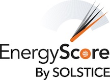

{ width=20% }

Solstice EnergyScore, a machine learning algorithm that delivers a more effective and more equitable qualification metric. Through a grant, I spent several months investigating the degree of bias existing in the algorithm, conducting a large literature review to identify leading quantitative measures of bias and fairness in ML. Results, along with a more context + lit review can be found [here](http://energyscore-bias-research.s3-website.us-east-2.amazonaws.com/#content). 